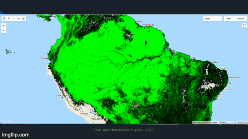
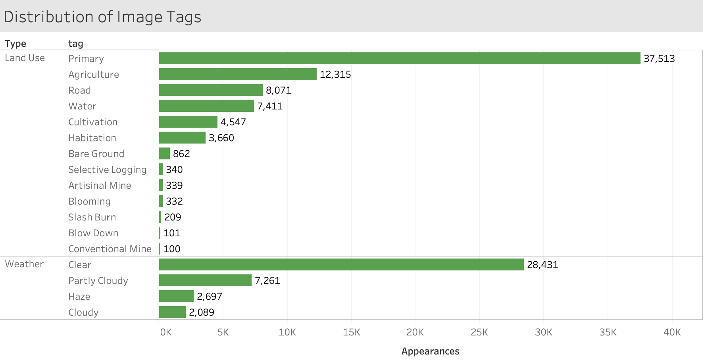
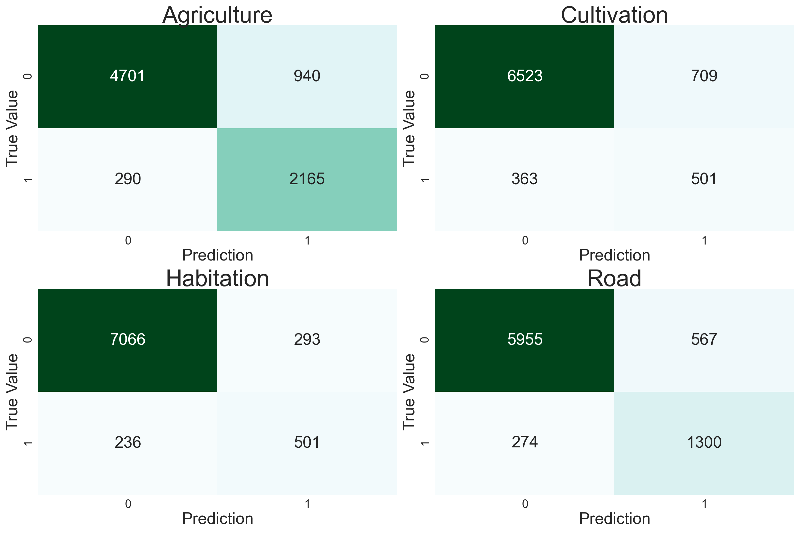
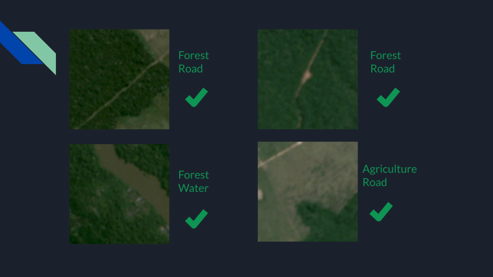

# Saving the Rainforest from Space
## Using Satellite Imagery to Identify the Leading Indicators of Deforestation

### Summary

In order to practice image classification and deep learning, I participated in the Kaggle Challenge *Understanding the Amazon from Space* sponsored by [Planet](https://www.planet.com/) 3 years after the fact. I developed a convolutional neural network that is able to identify leading indicators of deforestation, such as roads winding through the forest, agriculture, and cultivation, with a 92% score on the official challenge metric.

### Intro 

I think we all know the impacts that deforestation has, not only on the incredible biodiversity contained within rainforests, but on humanity. You can read more about this issue at the [WWF](https://www.worldwildlife.org/threats/deforestation-and-forest-degradation) or [Wikipedia](https://en.wikipedia.org/wiki/Deforestation).  

The good news is that things are being done about it, and I wanted to play a part in that, however small. In this project, I used high-level satellite imagery to build map layers that tracked forest loss and gain over time, and then low-level satellite imagery to identify specific areas where the leading indicators of deforestation were present.  This would allow authorities to be alerted of likely future areas of impact, who could then send teams to prevent it.

### Mapping Forest Loss and Gain

[Google Earth Engine](https://earthengine.google.com/) has tools that make it pretty easy to map changes in the earth over time, such as forest in this case.  Using the UMD Hansen imagery I was able to build the following 3-layer map that shows forest loss and gain between 2000 and 2015.  The first layer is forest in green, followed by red dots indicating forest loss and blue dots indicating forest gain during that 15-year period.  Note the plethora of red dots and lack of blue dots over the Amazon.

### Data

Planet provided 40,000 training images for the challenge, with 17 possible tags.  These were non-exlusive tags, and each picture had somewhere between 2 and 4 tags.  The distribution is below.

I separated the weather tags because they have zero relevance to identifying deforestation.  "Primary" means forest.  Also note the extreme rarity of classes such as "slash and burn" and "conventional mine".  These would prove difficult for models to catch.

### Building the Convolutional Neural Network

Naturally for an image classification task I turned to convolutional neural nets.  After some experimentation I realized that to get a truly accurate model, I would need to train a full model myself.  So that’s what I did.

I essentially took the VGG16 model available in Keras and allowed it to re-train every single layer, not just the top layers.  And my top layers of course were a bit different, with a 17-class output to match the 17 tags.  

The problem also required a sigmoid activation function on the output layer, and binary cross-entropy as the loss function.  While typically with a multi-class problem we would use Softmax activation and categorical cross-entropy, it made more sense to treat this problem as 17 separate binary classifications due to the non-exclusive nature of the classes.

The model performed quite well, at least on the official challenge metric, which was the mean F-Beta score across all 17 classes, with beta = 2.  It scored over 92%, which is within 1% of the challenge winner.  I was particularly focused on the classes that would uncover deforestation, such as roads, agriculture, habitation, and cultivation.  It fared pretty well here, see the confusion matrices below.

### Testing on New Imagery

But of course the real test would be to test this on new imagery.  Unfortunately I don't have the resources to apply the model to large areas, but technology is certainly available to do that.  I simply used Planet's explorer application and zoomed in on a few areas where we saw red dots earlier, and took a few screenshots.  It continued to perform well on the most important categories, such as roads and agriculture, and was able to distinguish roads from rivers.

Applications of machine learning such as this can lead to further success stories, such as Costa Rica, which has regained large areas of rainforest in the last 20 years.  When we rerun the map layers in 2040, hopefully there will be more blue than red.

